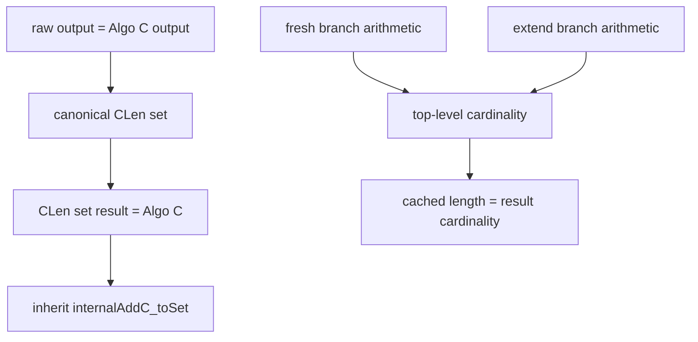

# Algo CLen Phase 1 checkpoint

Date: 2026-09-12

## Source state

- Lean started at `76eaef399cc89b145f949419e0c1b0c59f3d751d` on `main`,
  synchronized with `origin/main`, with a clean worktree.
- Production Rust was inspected read-only at
  `67467ad0945a957a25afd263d3bf1bc0507122b9` on
  `map-insert-cursor`, synchronized with `origin/map-insert-cursor`, with a
  clean worktree.

## Exact production length semantics

`RangeSetBlaze<T>::len` in `src/set.rs` is the number of represented scalar
elements, not the number of stored ranges. Its type is `T::SafeLen`. For the
ordinary integer implementations this is `u16` for 8-bit keys, `u32` for
16-bit keys and `char`, `u64` for 32-bit keys and IPv4, `u128` for 64-bit
keys, and `UIntPlusOne<u128>` for 128-bit keys and IPv6. Pointer-sized keys
use `u64` or `u128` according to target width. Float wrappers choose their own
capability-specific safe type; they are outside the present Lean `Int` model.

For an inclusive, valid range, `T::safe_len(start..=end)` computes
`end - start + 1`. Primitive implementations use an overflow-preserving
subtraction in the key width, widen the unsigned distance, and then add one.
The 128-bit and IPv6 implementations use `UIntPlusOne<u128>`, whose extra
`MaxPlusOne` value represents the full `2^128`-element universe. `char`
subtracts the Unicode surrogate block because surrogate code points are not
values of `char`.

The set representation and `SafeLen` choice ensure that the full universe is
representable. `UIntPlusOne` addition panics on a value above that universe;
ordinary unsigned arithmetic has the usual Rust overflow behavior. The
insertion updates stay in range because the cache remains the cardinality of a
subset of the key universe. Subtraction is valid because only lengths of
currently stored ranges are removed. Those safety claims are representation
invariants, not checked arithmetic at each cache update.

Endpoint overflow is handled separately from length arithmetic. The baseline
predecessor gap test uses `checked_add_one`; the `delete_extra` condition uses
short-circuiting so `end.add_one()` is reached only when the first comparison
did not establish interaction. Calls to `sub_one` occur only after strict
inequalities establish that the endpoint is not minimum.

The baseline Algo C updates an absolute cached length with separate additions
and subtractions:

1. fresh insertion inserts the input range, subtracts every swallowed stored
   range, adds any final extension beyond the input end, then adds the full
   input length;
2. predecessor extension first adds
   `safe_len(end_before..=end.sub_one())`, an equal-sized translation of the
   newly covered tail `end_before+1..=end`, then performs the same
   `delete_extra` accounting;
3. covered and empty inputs do not alter the cache.

## Rust, Algo C, and CLen correspondence

| Rust branch/helper | Lean Algo C | CLen state/update | Phase 2 obligation |
| --- | --- | --- | --- |
| `RangeSetBlaze { len: T::SafeLen, btree_map }` | canonical `ranges : List NR` | explicit incoming `Nat`, returned in `CLenResult` | incoming cache equals `rangesCardinality` |
| reject `end < start` | empty branch of `internalAddC` | unchanged ranges and length | empty range contributes zero |
| `range_mut(..=start).rev().next()` | non-strict `List.span`, then `getLast?` | identical non-strict split | predecessor decomposition |
| no predecessor | `insertAtNonstrictStartGap` | `freshInsertCLen` | strict/non-strict split agreement |
| checked successor is strictly below `start` | predecessor gap branch | `freshInsertCLen`, unchanged incoming cache | insertion-boundary gap |
| `end <= end_before` | covered branch | unchanged ranges and length | containment adds zero elements |
| add `safe_len(end_before..=end-1)` and extend predecessor | `extendPredecessor` | `extensionCardinality predecessor.hi input.hi` | translated interval has size `input.hi-predecessor.hi` |
| `internal_add2` inserts `(start,end)` | `internalAdd2NRs` | fresh accumulator at the strict-start split | output-list correspondence |
| `delete_extra` consumes the inserted/current entry | `deleteExtraNRs` setup | `finishDeleteExtraCLen` | setup correspondence |
| subtract each swallowed range | `deleteExtraNRs_loop` merge branch | `cachedLength - next.cardinality` | no Nat underflow; swallowed range was counted |
| `end_new = max(end_new,end_delete)` | loop's merged upper endpoint | same `max` update | merged-range correspondence |
| stop at first gap | loop no-merge branch | unchanged cache and untouched suffix | suffix remains counted and unchanged |
| add `safe_len(end..=end_new-1)` | merged final range | `extensionCardinality originalEnd finalHi` | extension is exactly newly exposed tail |
| add `safe_len(internal_range)` | completed fresh insertion | add `input.cardinality` | fresh input was not previously counted |

Rust tests forward interaction against the original insertion end while the
existing Lean Algo C loop tests against the accumulated end. On a canonical
stored list these agree: stored successor ranges have genuine gaps, so
absorbing one successor cannot make the next stored successor newly adjacent.
CLen follows the existing Algo C loop to make exact output correspondence the
primary theorem, while retaining Rust's subtract-then-final-add accounting.

## Mathematical model and design decision

`IntRange.cardinality : IntRange -> Nat` is zero for a reversed interval and
otherwise `Int.toNat (hi - lo + 1)`. `rangesCardinality` sums those
contributions, and `RangeSetBlaze.cardinality` projects through the stored
list. Canonicality makes the contributions disjoint.

`Nat` is the smallest faithful mathematical model for the Lean project's
unbounded `Int` key domain. It also abstracts exactly over every production
`SafeLen`: for a particular bounded Rust key type, the represented `Nat` is at
most the size of that key universe and therefore embeds in its `SafeLen`.
CLen does not model wrapping arithmetic because production's cache is intended
not to wrap. A future machine-level correspondence theorem should parameterize
the bounded scalar embedding and prove this representability bound.

CLen carries the absolute old/new cache, matching production. A signed delta
was rejected: Rust performs separate unsigned additions and subtractions, and
an integer delta would hide the underflow and representability obligations
that the proof is meant to expose.

## Executable and theorem architecture

`internalAddCLenRaw` is proof-free and mirrors the five Algo C branches.
`freshInsertCLen`, `extendPredecessorCLen`, `deleteExtraCLenLoop`, and
`finishDeleteExtraCLen` expose the production bookkeeping boundaries.
`internalAddCLen` packages the raw ranges as canonical using exact
correspondence with the already-proved Algo C result.

The reused Algo C endpoints are `internalAddC` itself, the canonical proof
carried by its result, and `internalAddC_toSet`. Phase 2 should also reuse the
existing predecessor/suffix and merge architecture conceptually; no Algo C
semantic correctness proof should be reconstructed.

## Phase 2 proof order

1. Prove interval cardinality formulas and translated-tail equalities.
2. Prove cardinality additivity for canonical/gap-separated list pieces.
3. Prove fresh-branch accounting.
4. Prove predecessor-extension accounting.
5. Prove exact raw-output correspondence branch by branch.
6. Compose the top-level cached-cardinality theorem.
7. Recheck the public projections and bounded-Rust interpretation.

## Temporary proof holes

| Theorem | Meaning | Dependencies | Classification |
| --- | --- | --- | --- |
| `freshInsertCLen_preserves_cardinality` | A fresh range inserted across a canonical gap, with swallowed successors subtracted and the new/extended pieces added, leaves the cache equal to the output cardinality. | interval cardinality, canonical split, swallowed-prefix arithmetic | branch-local bookkeeping |
| `extendPredecessorCLen_preserves_cardinality` | Extending the predecessor and then swallowing successors updates the cache by exactly the represented-set change. | predecessor/suffix decomposition, translated-tail cardinality, swallowed-prefix arithmetic | branch-local bookkeeping |
| `internalAddCLenRaw_corresponds` | Erasing the cache from raw CLen gives exactly `internalAddC`'s range list. | branch alignment, strict/non-strict split bridge, forward-loop equality | Algo C correspondence |
| `internalAddCLenRaw_preserves_cardinality` | Every top-level branch preserves a valid incoming cache. | the two branch-local bookkeeping theorems plus empty/covered no-op arithmetic | top-level composition |

There is no `sorry` in an executable definition, no source axiom, and no
representation-plumbing hole. The public set-result and set-semantics theorems
are already proved from the correspondence boundary and Algo C correctness.

## Metrics and verification

The v3 source manifest is
`361f0aa43920b4fb0e575166a4d85cc29e8c3a448e4f6bbc79943c71d84092d7`.
The repository moved from 5,467 to 5,710 physical Lean LOC and from 4,779 to
4,939 active Lean LOC. Comment-only LOC moved from 358 to 409. Definitions and
abbreviations moved from 83 to 94. The dashboard reports 50 public and 75
private lemma/theorem declarations, up from 43 and 71: four new public Basic
cardinality lemmas, three public CLen endpoints, and four private CLen proof
boundaries.

`AlgoCLen.lean` is 215 physical LOC, 143 active LOC, and 47 comment-only LOC.
It has eight definitions, four private theorem boundaries, three public
theorems, and four temporary `sorry`s. Its proof dashboard has no induction,
`cases`, `by_cases`, `have`, `simp`, `simpa`, `omega`, or `linarith`; the three
`rw` occurrences are in completed public projection proofs. Five mirrored
algorithm/bookkeeping definitions occupy 59 physical declaration lines. This
is deliberate CLen-local control flow; no existing Algo C executable was
changed or copied verbatim.

Verification passed:

- direct compilation of `RangeSetBlaze/AlgoCLen.lean`;
- direct compilation of `RangeSetBlaze.lean`;
- full `lake build`;
- all six v3 metric collector regression tests;
- `git diff --check`;
- concrete execution checks for fresh, separated, covered, extending/merging,
  and reversed-input branches;
- forbidden-source scan, with only the four expected theorem `sorry`s;
- final Rust worktree check, with no modifications.

## Risks and open questions

The main Phase 2 risk is Nat subtraction: correctness must establish that each
swallowed range is still included in the incoming cache before subtraction.
The second risk is proving exact list equality despite Rust's fixed-end scan
predicate and Lean Algo C's accumulated-end predicate; canonical gaps are the
reason they agree. Finally, the present theorem is mathematical, not a
bit-level theorem about every `SafeLen` implementation. A later production
correspondence layer should state the bounded key embedding explicitly if that
level of verification is desired.

Suggested commit message: `Add compiling Algo CLen bookkeeping skeleton`.
