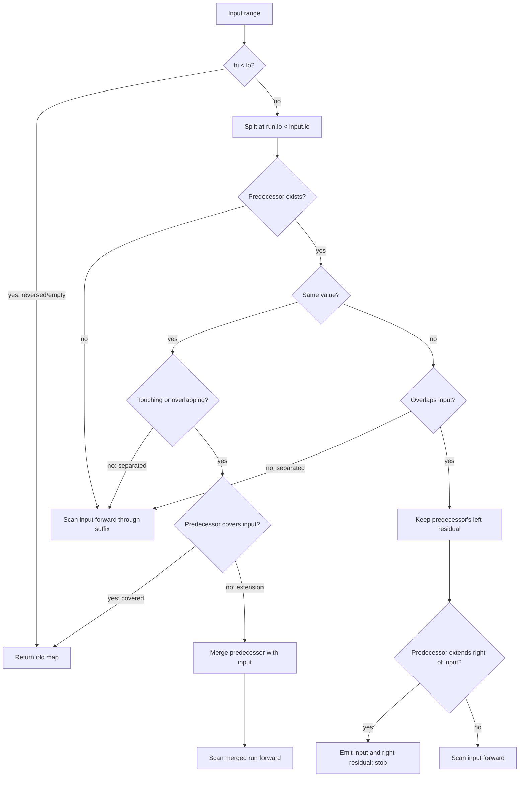
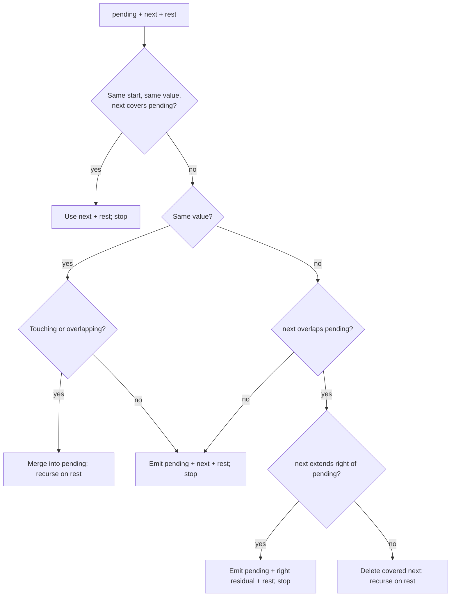
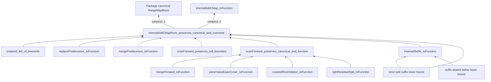

# Why production-shaped Algo C map insertion is correct

This note explains the argument behind `internalAddCMap` without assuming Lean
experience.  The implementation models the production cursor algorithm with a
canonical list of labeled integer runs.  Its correctness theorem says that the
result is still canonical and denotes exactly a pointwise overwrite.

## 1. Run and map vocabulary

A `Run Value` is a nonempty inclusive integer interval `[lo, hi]` together with
a value.  For example, `[3, 7] ↦ blue` maps every integer from 3 through 7 to
`blue`.

`Run.disjointBefore a b` means `a.hi < b.lo`: the runs are ordered and do not
overlap.  The stronger relation `Run.before a b` additionally requires a real
integer gap when the values agree.  Thus these neighbors are canonical:

```text
[1, 3] ↦ red    [4, 8] ↦ blue
[1, 3] ↦ red      [5, 8] ↦ red
```

but `[1, 3] ↦ red` followed by `[4, 8] ↦ red` is not canonical, because two
touching equal-valued runs should be represented by `[1, 8] ↦ red`.

A map is canonical when every earlier run is `Run.before` every later run.
`runsToFunction` interprets the list as a partial function `Int → Option Value`:
it returns the value of the first containing run, or no value if no run contains
the key.  Canonical runs never overlap, so “first” is unambiguous for valid maps.

For an input `[lo, hi] ↦ value`, `overwrite old input value` is the function

```text
key inside [lo, hi]   ↦ value
key outside [lo, hi]  ↦ old(key)
```

If `hi < lo`, the input is reversed (empty), so overwrite changes nothing.

## 2. Operational decision tree

The algorithm splits the old list immediately before the first run whose start
is at least the input start.  The last run in the prefix, when present, is the
predecessor.  The suffix is then scanned only as far as the overwrite or
same-value normalization can have an effect.



This is a structural model of predecessor lookup and cursor movement.  It does
not sort, globally coalesce, or rebuild from a mathematical function.

## 3. Forward scan

The scan carries one `pending` run and considers the first unprocessed run
`next`.



The recursive proof maintains two central invariants:

1. **Canonicality.** The produced list is ordered, nonoverlapping, and contains
   no touching equal-valued neighbors.
2. **Exact function preservation.** The produced list denotes the same partial
   function as `pending :: suffix`.

Each branch has a small semantic fact: equal-valued merging preserves values;
an exact same-valued cover already represents `pending`; a differently-valued
run covered by `pending` is hidden by first-match semantics and may be deleted;
and an overhanging differently-valued run can be replaced by its part strictly
to the right of `pending`.

The induction is over the unprocessed suffix.  Only the merge and covered-run
deletion cases recurse, and both consume its first element.

## 4. Predecessor preparation

The diagrams below use `P` for the untouched prefix, `p` for the predecessor,
`I` for the input, and `S` for the forward suffix.

### No predecessor or a separated predecessor

```text
No predecessor:                    Separated predecessor:

I────────► scan S                  P ─ p    gap    I────────► scan S
```

The input is scanned into `S`.  In the separated case the complete old prefix
is untouched.  Canonical ordering proves that it remains before every scan
output.

### Same-valued predecessor covers the input

```text
p:  |-----------------------|  value v
I:        |----------|         value v
```

Every overwritten key already has value `v`, so the old map is returned.  No
normalization is needed.

### Same-valued predecessor is extended

```text
p:  |------------|             value v
I:       |----------------|     value v
     \________ merged ________/
```

The merged pending run keeps `p.lo`, takes `max(p.hi, I.hi)`, and is handed to
the forward scan.  The old prefix before `p` remains before everything emitted
by the scan.

### Differently-valued overlap with only a left residual

```text
p:  |------------|             value old
I:       |----------------|     value new
out: |left| |------ I -----| ──► scan S
```

The part of `p` before `I.lo` survives.  The rest is overwritten.  Because the
input reaches at least as far right as `p`, no right residual is needed.

### Differently-valued overlap with both residual sides

```text
p:  |--------------------------|  value old
I:       |------------|           value new
out: |left| |---- I ---| |right| S
```

The right residual starts at `I.hi + 1`.  It is already the exact stopping
boundary: it restores the old value immediately after the overwrite, and the
old canonical order places all of `S` after it.  Therefore no forward scan is
needed.

## 5. Proof dependencies



The combined `scanForward_preserves_canonical_and_function` deliberately proves
canonicality and function preservation in one induction, since every scan
branch determines both facts.
At the top level, predecessor and prefix lemmas connect that scan contract back
to the complete old list.  The two projections of
`internalAddCMapRuns_preserves_canonical_and_overwrite`
then serve different consumers: `.1` justifies constructing a canonical map;
`.2` proves the public semantic theorem.

## 6. Why the scan may stop

At the first unaffected run, `pending` ends strictly before `next`; if their
values agree, there is also a genuine integer gap.  Because the suffix was
canonical before insertion, every later run starts still farther right.  No
later run can overlap or touch `pending`, so the rest of the suffix is
unaffected.

A right residual also ends normalization immediately.  It begins exactly one
integer after the pending overwrite and has a different value.  The original
run containing that residual preceded every later suffix run, so canonical
ordering places those later runs strictly after the residual.  Nothing later
can reach backward across this boundary.

The same ordering fact explains why deleting a fully covered run is safe but
does not justify stopping: after deletion, a later run might still overlap the
pending overwrite, so the scan must recurse.

## 7. Final correctness statement

For every canonical input map, range, and value,

```text
toFunction(internalAddCMap(map, input, value))
  = overwrite(toFunction(map), input, value).
```

The construction of `internalAddCMap` is accepted only after the list-level
proof establishes canonicality.  Function equality is pointwise, so it states
both required behaviors at once:

- outside the input interval, the result equals the old function;
- inside a nonempty input interval, the result equals the new value.

For a reversed input, both the executable operation and `overwrite` are the
identity.

## Proof-sketch API-friction audit

| Explanation boundary | Class | Assessment |
|---|---|---|
| Modeling cursor state as a prefix, predecessor, and suffix | A — acceptable representation detail | The split is the list analogue of production predecessor lookup and belongs in the model. |
| Recovering the predecessor with `getLast?` and removing it with `dropLast` | A — acceptable representation detail | These are list encodings of “peek previous” and “replace previous”; the proof sketch can use domain terms. |
| Converting `List.span` to `takeWhile`/`dropWhile` to prove reconstruction and the suffix lower bound | D — omittable implementation detail | Readers need the ordered-suffix fact, not the library conversion used to prove it. |
| Carrying subtype proofs that constructed intervals are nonempty | D — omittable implementation detail | This is Lean's static well-formedness evidence and changes no runtime branch. |
| The former names `exactCover_toFunction`, `deleteCovered_toFunction`, and `rightResidual_toFunction` | B — documentation/naming issue | They under-described same-value cover, run deletion, and residual splitting; the cleanup gives the branch facts explicit names. |
| Reattaching an untouched prefix through `prepend_left_of_overwrite` | A — acceptable representation detail | It states a real compositional boundary: runs entirely left of the overwrite remain unchanged. |
| Preserving the prefix/scan boundary through `scanForward_preserves_left_boundary` | A — acceptable representation detail | The semantic scan contract alone cannot prove cross-boundary canonicality; this is genuine structural information. |
| The strict-split suffix lower-bound lemma resembles the shared `NR` theorem in `Basic.lean` | C — potential API opportunity, not taken | The shared theorem is for unlabeled `NR` lists, while this split is over labeled `Run` lists. Adapting through `List.map` and span correspondence would move rather than remove mechanics; one map consumer does not yet justify a second shared theorem. |
| The unused extension premise formerly carried by `mergePredecessor_toFunction` | B — interface issue | The semantic equality holds whether or not the input extends the predecessor, so the proof helper now states only the assumptions it needs. |

The sketch exposes no reason to reopen the proof architecture.  Its only class-C
candidate is a projected ordered-suffix theorem for labeled runs; current reuse
does not justify promoting it.

**Readability test:** Yes.  A CS-trained reader can understand why Algo C is
correct from the decision tree, scan invariant, predecessor cases, and stopping
argument above without opening the Lean source.
