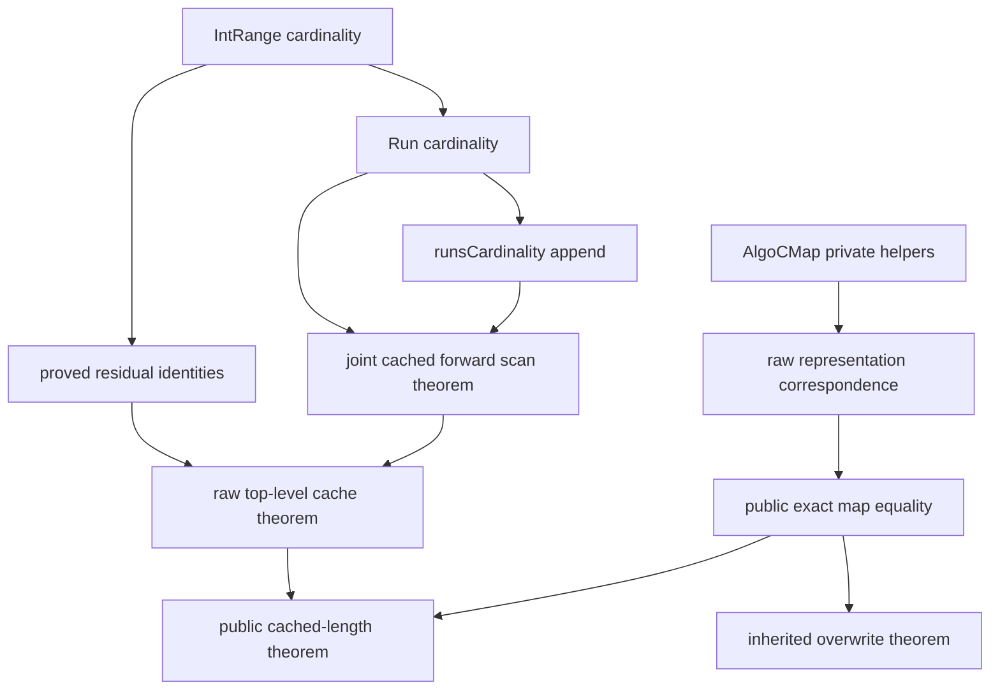
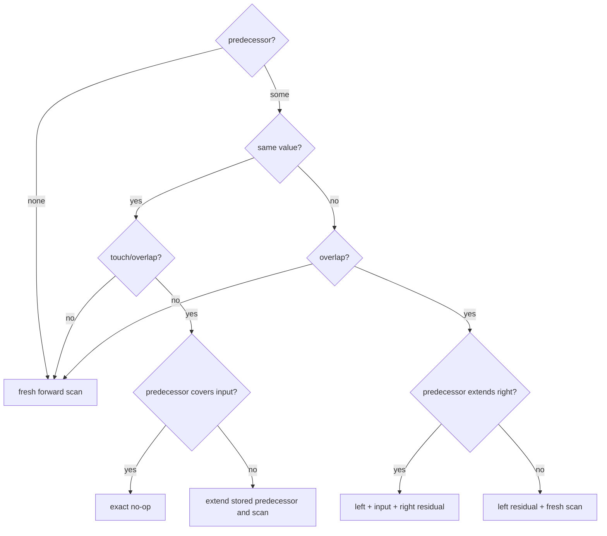
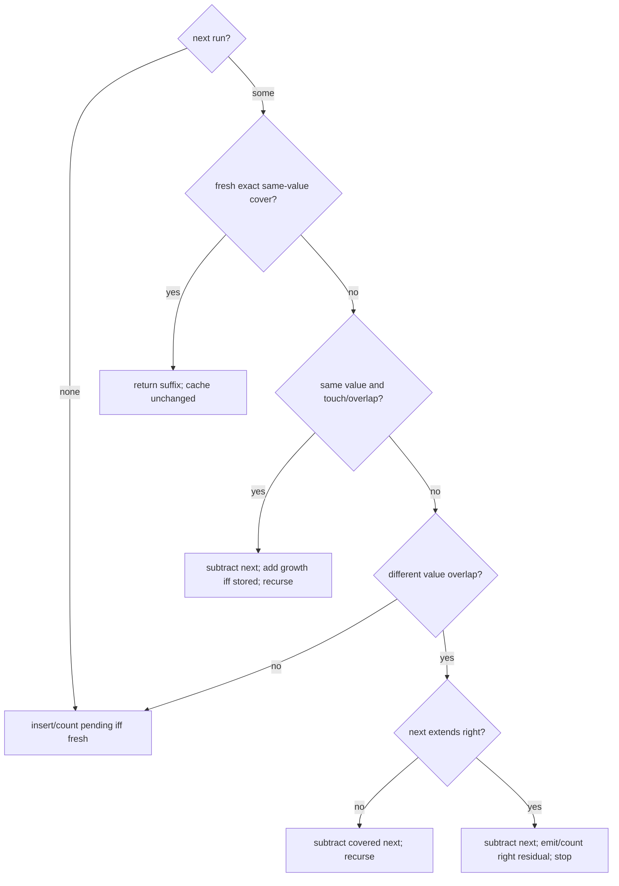

# Algo CMapLen Phase 1 checkpoint

Date: 2026-09-12

## Source identity and scope

The Lean work started from clean `main` at
`033e67caaa9ff13e3a1c72ee73b92d3a1337d42f` (tree
`20d52b740559a8512e8d255494c7d0df395387d3`), synchronized with
`origin/main`.

The read-only Rust audit started from clean `map-insert-cursor` at
`67467ad0945a957a25afd263d3bf1bc0507122b9` (tree
`e7c046d722549bcee4e9b897b133c24c0179db4a`), synchronized with its upstream.

There is an important scope distinction. The existing Lean `AlgoCMap`
branch tree was audited previously against Rust's experimental cursor path,
not literally against `internal_add_baseline`. The baseline has extra
same-start and "before-before" optimizations. Both paths implement the same
canonical overwrite and the same net cardinality changes, but their mutation
sequences differ. CMapLen follows AlgoCMap exactly and normalizes the baseline
add/subtract rules into the cursor-shaped pending/stored scan. A claim of
instruction-for-instruction correspondence with `internal_add_baseline` would
therefore be too strong.

## What map length means

`RangeMapBlaze::len` has storage type `T::SafeLen`. It is the number of mapped
scalar keys, not the number of B-tree entries or stored runs. The slow checker
sums `T::safe_len(start..=end)` over all runs. A run's value has no direct
cardinality contribution; value equality only controls whether neighboring
runs merge.

For the Lean `Int` model, an inclusive run `[lo, hi]` contributes
`IntRange.cardinality`, namely `hi - lo + 1` for a nonempty interval. Thus:

- a left residual retains exactly `[old.lo, input.lo - 1]`;
- a right residual retains exactly `[input.hi + 1, old.hi]`;
- a fully swallowed run is subtracted in full;
- an overhanging run is subtracted in full and its right residual re-added;
- an equal-valued merge removes the old successor and counts only the final
  union, never both overlapping descriptions;
- an already-stored pending run adds only newly exposed right-hand keys;
- an unstored pending run is counted only when it is finally inserted;
- exact same-value coverage returns without changing the cache.

Rust's generic meaning is the number of valid values of `T`; notably `char`
excludes surrogate code points. The present Lean model intentionally uses
contiguous mathematical integers, as do the existing algorithms.

## Mathematical model

The shared layer now defines:

```lean
RangeMapBlaze.Run.cardinality : Run Value → Nat
RangeMapBlaze.runsCardinality : List (Run Value) → Nat
RangeMapBlaze.cardinality : RangeMapBlaze Value → Nat
```

`Run.cardinality` ignores the value and delegates to the run range's existing
`IntRange.cardinality`. `runsCardinality` is an additive fold, with proved
nil, cons, and append equations. `RangeMapBlaze.cardinality` applies that fold
to the packaged canonical run list.

Three local residual equations are already proved:

1. old predecessor = left residual + removed tail;
2. old successor = overwritten prefix + right residual;
3. surrounding predecessor = left residual + input + right residual.

They remain local because their statements name AlgoCMap's private residual
constructors. The underlying arithmetic reuses `IntRange.cardinality`.

## Rust ↔ AlgoCMap ↔ CMapLen branch audit

| Branch | Old affected runs | New affected runs | Rust/cache rule | CMapLen rule | Remaining proof obligation |
| --- | --- | --- | --- | --- | --- |
| Reversed/empty input | none | unchanged | return; cache unchanged | return `⟨map, cache⟩` | public projection is proved directly |
| Strict lower-bound split | none | none | cursor lower bound chooses predecessor/suffix | same strict `List.span` as AlgoCMap | raw composition reconstructs cardinality |
| No predecessor | suffix only | pending plus scanned suffix | pending starts uncounted | scan with `pendingIsStored = false` | joint scan invariant |
| Predecessor unaffected | predecessor and suffix | predecessor unchanged plus scanned insertion | no pre-scan cache update | keep prefix; fresh scan | raw composition |
| Same-value predecessor merge | predecessor | extended stored pending | add `[old.hi + 1, input.hi]` | add `rightExtensionCardinality old.hi input.hi` | scan invariant uses shared right-extension theorem |
| Different-value predecessor trim | old predecessor | left residual plus insertion | subtract `[input.lo, old.hi]` | same absolute subtraction | prove subtraction is contained in valid cache |
| Left residual creation | old predecessor | `[old.lo, input.lo-1]` | residual stays stored/counting | same | proved residual-cardinality equation |
| Right residual creation from predecessor | old predecessor | left + input + right | removed tail is subtracted; input/right are added | same normalized update | proved two-sided split equation; raw composition remains |
| Exact-cover early return | existing same-valued cover | unchanged existing runs | cache unchanged | cache unchanged | scan theorem rules out this branch for stored pending |
| Same-value forward merge | pending and successor | merged pending | subtract successor; if pending stored, add only right growth | identical absolute update | joint scan invariant and non-underflow |
| Differently-valued covered deletion | pending and covered successor | pending | subtract successor in full | identical subtraction and recurse | joint scan invariant and non-underflow |
| Right-residual split and stop | pending and overhanging successor | pending plus successor residual | subtract successor; insert/count residual; count pending iff fresh | identical normalized update | joint scan invariant |
| First unaffected run and stop | pending and untouched suffix | pending followed by suffix | insert/count pending iff fresh | `countPendingIfFresh` | joint scan invariant |

The baseline Rust implementation realizes fresh insertion through
`internal_add2`: `delete_extra` first subtracts consumed successors, restores
same-value extension or a right residual, and then adds the original input.
CMapLen's fresh-pending rule is the algebraic normalization of those updates:
it delays the pending contribution and adds the final merged pending once.

## Residual arithmetic

For an overlapping predecessor `[a,b]` and insertion beginning at `s`, with
`a < s ≤ b`:

```text
card [a,b] = card [a,s-1] + card [s,b]
```

For an overhanging successor `[a,b]` and pending ending at `e`, with
`a ≤ e < b`:

```text
card [a,b] = card [a,e] + card [e+1,b]
```

For a predecessor surrounding nonempty input `[s,e]`:

```text
card [a,b] = card [a,s-1] + card [s,e] + card [e+1,b]
```

These identities justify subtraction followed by residual reinsertion without
appealing to truncating `Nat.sub`.

## Executable structure

`CMapLenResult` exposes `mapResult` and `cachedLength`. The private executable
layer consists of `CMapLenRawResult`, `countPendingIfFresh`,
`scanForwardCMapLen`, and `internalAddCMapLenRaw`.

`scanForwardCMapLen` deliberately carries `pendingIsStored`. This is the Lean
counterpart of Rust's `pending_is_stored`: a stored pending run is already in
the absolute cache and receives only right-extension additions; a fresh one
is absent from the cache until final insertion. No definition recomputes the
cardinality of the final output.

There are two intentional executable branch-tree duplications: the cached
forward recursion mirrors private `scanForward`, and the cached raw dispatcher
mirrors private `internalAddCMapRuns`. Both reuse the existing merge and
residual constructors. Refactoring either old private executable to a generic
callback/state framework would broaden this Phase 1 change and obscure the
protected production-shaped code.

## Public contracts

Exact representation correspondence is stated as:

```lean
theorem internalAddCMapLen_mapResult {Value : Type*} [DecidableEq Value]
    (map : RangeMapBlaze Value) (cachedLength : Nat)
    (input : IntRange) (value : Value) :
    (internalAddCMapLen map cachedLength input value).mapResult =
      internalAddCMap map input value
```

The headline cache invariant is stated as:

```lean
theorem internalAddCMapLen_cachedLength {Value : Type*} [DecidableEq Value]
    (map : RangeMapBlaze Value) (cachedLength : Nat)
    (input : IntRange) (value : Value)
    (hlength : cachedLength = map.cardinality) :
    (internalAddCMapLen map cachedLength input value).cachedLength =
      (internalAddCMapLen map cachedLength input value).mapResult.cardinality
```

Both public projection proofs are filled. `internalAddCMapLen_toFunction`
rewrites by exact map equality and applies the existing
`internalAddCMap_toFunction`; it does not re-prove overwrite semantics.

## Proof architecture and remaining holes



Exactly three temporary `sorry`s remain:

1. `scanForwardCMapLen_preserves_correspondence_and_cardinality` proves in one
   recursion both exact output equality with `scanForward` and the absolute
   cached-base invariant. It depends on run/list cardinality, right-extension
   arithmetic, and the stored/fresh state contract. Classification:
   **forward-scan bookkeeping and representation correspondence**.
2. `internalAddCMapLenRaw_corresponds` proves exact raw run-list equality with
   `internalAddCMapRuns`. It depends on the cached scan correspondence and
   branch reduction. Classification: **representation correspondence**.
3. `internalAddCMapLenRaw_preserves_cardinality` composes split/prefix facts,
   predecessor residual arithmetic, and the scan invariant under a valid
   incoming cache. Classification: **predecessor bookkeeping and top-level
   composition**.

No executable declaration contains `sorry`.

## Predecessor decision tree



## Forward scan



AlgoCMap's exact-cover test is syntactically unconditional. Rust cursor code
guards it with `!pending_is_stored`. The scan proof therefore carries the
reachable-state fact that a stored pending starts strictly before every suffix
run, making exact-start cover impossible in the stored case.

## Nat subtraction obligations

The two executable subtraction sites are successor removal and predecessor
tail trimming. Phase 2 must explicitly derive:

- `next.cardinality ≤ cachedLength` from the scan cache decomposition;
- removed predecessor tail cardinality ≤ the whole incoming cache from the
  prefix/predecessor/suffix decomposition and the proved left-residual split;
- after subtraction, the cache is exactly the untouched base plus the
  still-counted pending/suffix, using `Nat.sub_eq_iff_eq_add` only after the
  containment fact is available.

Lean `Nat` cannot overflow. The model proves mathematical non-underflow; it
does not formalize bit-level `SafeLen` capacity, whose Rust type is selected to
hold the entire key universe.

## Phase 1 metrics

Metrics use `scripts/phase0_metrics.py` collector/schema v3. Counts are a
dashboard, not a composite score.

| Metric | AlgoCMap file after | CMapLen section delta |
| --- | ---: | ---: |
| Physical LOC | 1,222 | 282 |
| Active LOC | 1,090 | 228 |
| Definitions/abbreviations | 10 | 4 |
| Public theorems/lemmas | 4 | 3 |
| Private theorems/lemmas | 19 | 6 |
| `induction` | 5 | 0 |
| `cases` | 0 | 0 |
| `by_cases` | 35 | 2 |
| `have` | 137 | 10 |
| `rw` | 31 | 18 |
| `simp` | 101 | 6 |
| `simpa` | 57 | 3 |
| `omega` | 51 | 18 |
| `linarith` | 0 | 0 |
| temporary `sorry`s | 3 | 3 |

Repository totals after the Lean additions are 6,694 physical LOC, 5,809
active LOC, 107 definitions/abbreviations, 61 public and 89 private
lemma/theorem declarations, 31 `induction`, 42 `cases`, 126 `by_cases`, 724
`have`, 176 `rw`, 467 `simp`, 276 `simpa`, 152 `omega`, and 1 `linarith`.

Shared additions are `Run.cardinality`, `runsCardinality`, its nil/cons/append
lemmas, and `RangeMapBlaze.cardinality`. CMapLen has five private executable
support declarations and six private proof contracts. There are two duplicated
AlgoCMap executable branch trees and zero duplicate recursive proof theorems:
the single planned scan induction proves correspondence and bookkeeping
together.

## Verification

- `lake env lean RangeSetBlaze/AlgoCMap.lean`: passed, with exactly the three
  expected temporary-`sorry` warnings.
- `lake env lean RangeSetBlaze.lean`: passed after refreshing build objects.
- `lake build`: passed; 1,886 jobs completed, with only the same three warnings.
- v3 metric regression tests: all 6 passed.
- `git diff --check`: passed.
- Source scans found no `admit`, source `axiom`, `unsafe`, `implemented_by`,
  or `sorryAx`; the only active `sorry` tokens are the three listed contracts.
- A small executable smoke test produced cached lengths `3`, `3`, and `5` for
  fresh `[1,3]`, middle overwrite `[2,2]`, and same-value extension `[2,5]`.
- The public theorem axiom inventory contains `sorryAx` as expected at this
  skeleton checkpoint, plus the existing standard `propext`,
  `Classical.choice`, and `Quot.sound` dependencies. Phase 2 must eliminate
  `sorryAx` by filling the three named contracts.
- The Rust repository remains at its starting HEAD with an empty porcelain
  status; it was not modified.

## Phase 2 order and risks

Recommended proof order:

1. prove the joint scan theorem, naming the removal containment fact before
   each `Nat.sub` rewrite;
2. prove raw run correspondence by following the shared branch tree;
3. prove raw cache preservation, using the already-proved residual equations;
4. re-run public theorem axiom checks and then remove any proof-only scaffolding
   made redundant by the completed composition.

The main architectural risk is the baseline/cursor wording mismatch described
above. Other risks are losing the stored-state exclusion of exact cover,
relying accidentally on truncated subtraction, or attempting to bridge two
representations only by `toFunction` equality when canonical uniqueness is not
available.

Suggested skeleton commit message (not executed):

```text
Add executable CMapLen model and Phase 1 proof skeleton
```
