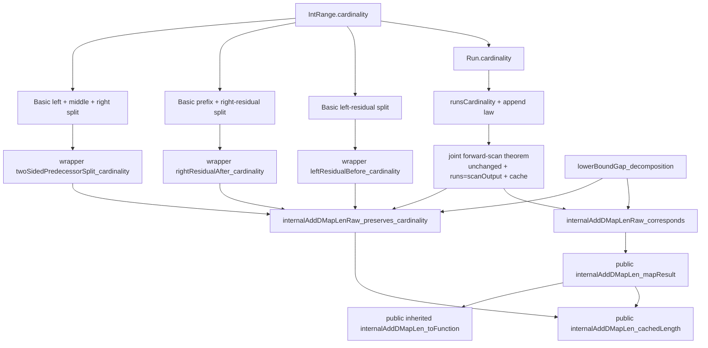
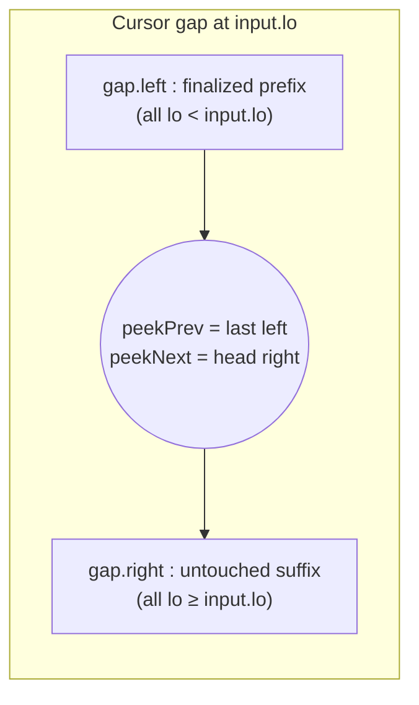
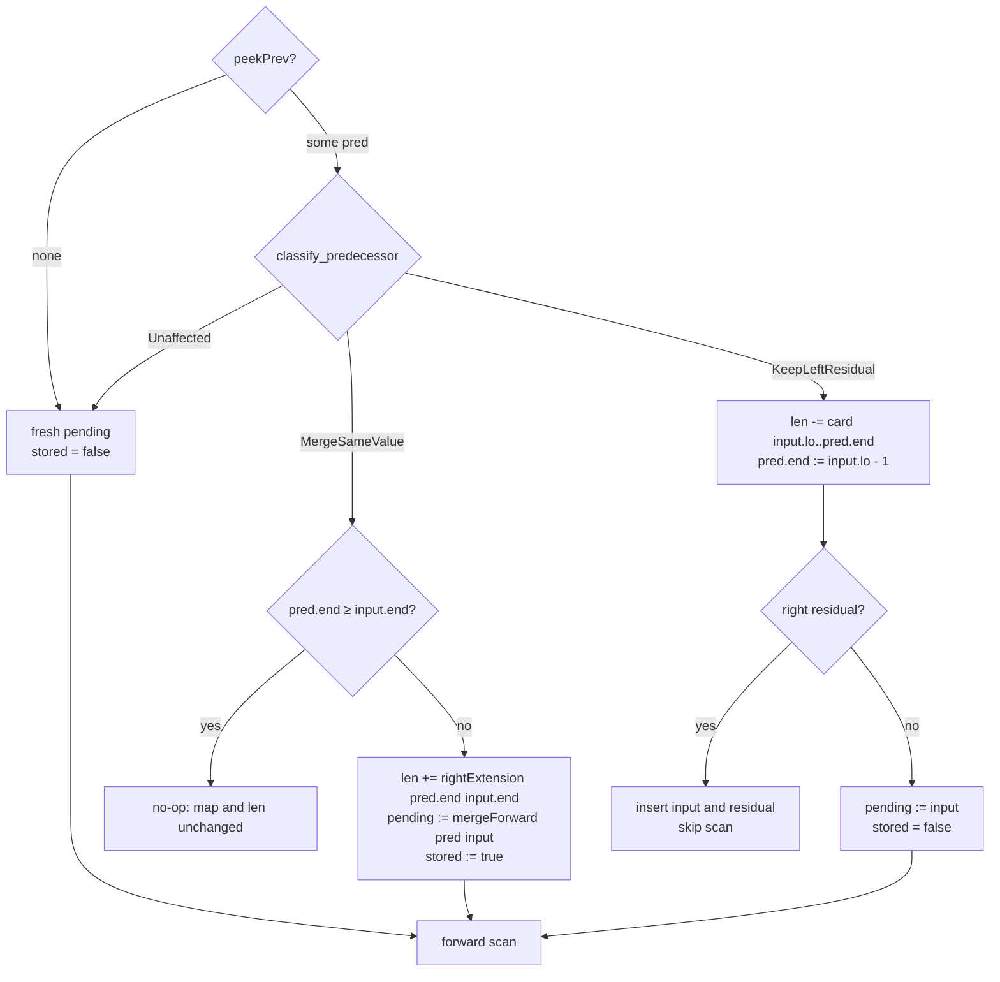
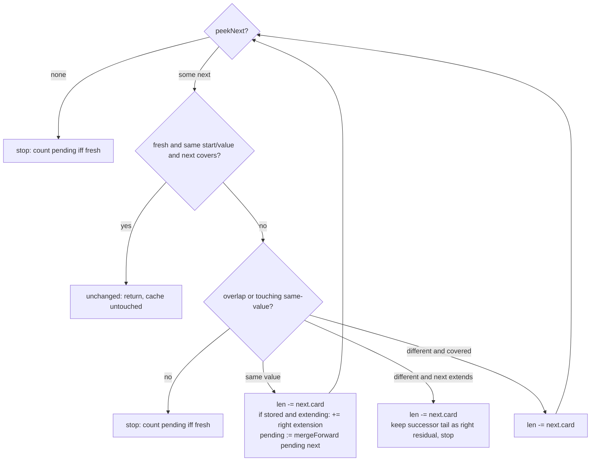
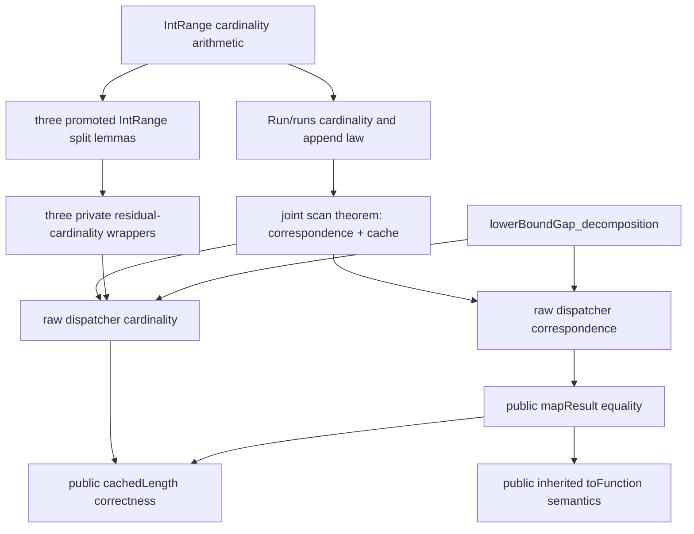

# Algo DMapLen Phase 1 checkpoint

Date: 2026-09-12

## 1. Source identity and scope

The Lean work started from `main` at
`76537538da71ca5e7e13cd51e240abd519c07a3f` (tree
`70449ab69e85239b1cb40f0316418eb035725635`), synchronized with `origin/main`.
The worktree was clean. Three files are modified by this phase:

- `RangeSetBlaze/AlgoDMap.lean` (the DMapLen section);
- `RangeSetBlaze/Basic.lean` (three promoted `IntRange` cardinality lemmas);
- `RangeSetBlaze/AlgoCMap.lean` (CMapLen proofs re-pointed at the promoted
  lemmas; net active LOC falls).

The read-only Rust audit started from `map-insert-cursor` at
`67467ad0945a957a25afd263d3bf1bc0507122b9` (tree
`e7c046d722549bcee4e9b897b133c24c0179db4a`), synchronized with its upstream and
clean. The Rust repository was not modified.

DMapLen is not a new map algorithm. It is `AlgoDMap` plus the production
cursor's absolute cached-key-length (`self.len`) mutations. Its exact
representation equality with `AlgoDMap` is stated as a public theorem whose
proof composes the remaining raw-correspondence contract, and its cache
correctness is decomposed into a joint scan contract plus a raw dispatcher
contract. At this checkpoint those contracts are the three open `sorry`s.

## 2. What map cached length means

`RangeMapBlaze::len` has Rust storage type `T::SafeLen`. It is the number of
mapped scalar keys, not the number of `BTreeMap` entries or stored runs. The
slow checker `len_slow` sums `T::safe_len(&(start..=end))` over every run
(`src/map.rs:1023`, `src/map.rs:1477`), and `safe_len(r) = (end - start) + 1`
for a nonempty inclusive range (`src/integer.rs:370`). A run's value has no
cardinality contribution; value equality only decides whether neighboring runs
merge.

For the Lean `Int` model, an inclusive run `[lo, hi]` contributes
`IntRange.cardinality`, namely `hi - lo + 1` for a nonempty interval, and
`RangeMapBlaze.cardinality map = runsCardinality map.runs`. Thus:

- a left residual retains exactly `[old.lo, input.lo - 1]`;
- a right residual retains exactly `[input.hi + 1, old.hi]`;
- a fully swallowed run is subtracted in full;
- an overhanging run is subtracted in full and its right residual re-added;
- an equal-valued merge removes the old successor and counts only the final
  union, never both overlapping descriptions;
- an already-stored pending run adds only newly exposed right-hand keys;
- an unstored pending run is counted only when it is finally inserted;
- exact same-value coverage returns without changing the cache.

Rust's generic meaning is the number of valid values of `T` (for example `char`
excludes surrogate code points). The Lean model intentionally uses contiguous
mathematical integers, as do the existing algorithms.

## 3. Exact production DMap cached-length behavior

The production path is `RangeMapBlaze::internal_add_cursor`
(`src/map.rs:1823`), the cursor dispatcher, plus
`RangeMapBlaze::cursor_scan_forward` (`src/map.rs:1732`) and
`cursor_insert_range` (`src/map.rs:1715`). Cached length is mutated only by
add/subtract, never recomputed except in the `debug_assert!` slow check
(`src/map.rs:1927`). The exact ordering is:

1. Empty/reversed input (`pending_end < pending_start`) returns before any
   mutation; `len` is unchanged.
2. `lower_bound_mut(Bound::Included(&pending_start))` places the gap:
   `peek_prev` is the greatest stored start below `pending_start`, `peek_next`
   the least stored start at or above it.
3. One `classify_predecessor` decision fixes the whole predecessor handling
   before the scan.
4. `KeepLeftResidual`: `len -= safe_len(pending_start..=stored_end)`, the
   predecessor end is shortened to `pending_start - 1`, and any right residual
   is remembered. When a right residual exists the forward scan is skipped
   entirely (`if right_residual.is_none()`), and the input plus residual are
   inserted after.
5. `MergeSameValue`: if `stored_end >= pending_end` it returns with no change;
   otherwise `len += safe_len(stored_end + 1 ..= pending_end)`, the predecessor
   end is grown to `pending_end`, and `pending_is_stored` becomes true.
6. `cursor_scan_forward`: for each visited successor it first removes it and
   subtracts `safe_len(stored_start..=removed.end)` *before* any re-add. On a
   same-value merge, if the pending was stored and the successor extends it,
   `len += safe_len(pending_end + 1 ..= extended_end)` and the stored entry is
   grown in place. `DeleteOverwritten` adds nothing back. A right-residual split
   subtracts the successor and stops with the residual retained.
7. Exact fresh same-start cover returns `unchanged` and the caller returns
   without inserting anything.
8. After the scan, `internal_add_cursor` inserts the finished pending only when
   `!pending_is_stored` (`len += safe_len(pending_start..=pending_end)`) and then
   inserts any right residual (`len += safe_len(residual_start..=residual_end)`).

Absolute add/subtract is thus used throughout; there is no final recomputation
and no reliance on truncated arithmetic.

## 4. Rust ↔ AlgoDMap ↔ DMapLen correspondence

`DMapLen` mirrors `AlgoDMap` branch-for-branch, and `AlgoDMap` mirrors the
classified cursor path. Cache updates are named by the shared cardinality
vocabulary (`IntRange.cardinality`, `IntRange.rightExtensionCardinality`,
`runsCardinality`).

| Rust cursor operation / branch | AlgoDMap operation / branch | Old affected runs | New affected runs | Cached-length update (Rust) | DMapLen update | Proof obligation |
| --- | --- | --- | --- | --- | --- | --- |
| Reversed/empty input: `pending_end < pending_start` | `internalAddDMap` `input.hi < input.lo` | none | unchanged | `return`, no mutation | `⟨map, cachedLength⟩` | proved directly in `internalAddDMapLen_mapResult` / `_cachedLength` |
| `lower_bound_mut(Included)` gap positioning | `lowerBoundGap input.lo runs`, `peekPrev`, `peekNext` | none | none | none | same gap; no cache update | already-proved `lowerBoundGap_decomposition` (`runs = left ++ right`, endpoint bounds) |
| Predecessor absent `peek_prev() = None` | `none` branch | suffix only | fresh pending + scanned suffix | pending starts uncounted | `scanForwardDMapLen fresh false cachedLength gap.right` | joint scan invariant with `base = runsCardinality gap.left` |
| Predecessor unaffected | `.unaffected` branch | predecessor + suffix | predecessor + scanned insertion | no pre-scan update | keep `gap.left`; fresh scan | joint scan invariant |
| Predecessor same-value merge | `.mergeSame` (non-cover) | predecessor | extended stored pending | `len += safe_len(stored_end+1..=pending_end)` | `cachedLength + rightExtensionCardinality pred.hi input.hi`, then scan with `pendingIsStored := true` | `NR.cardinality_eq_add_right_extension` gives `grown.card = pred.card + extension`; scan invariant with `base = runsCardinality (gap.left.dropLast)` |
| Predecessor different-value trim | `.trimDifferent` | old predecessor | left residual + insertion | `len -= safe_len(pending_start..=stored_end)`; `end := left_end` | `afterTrim = cachedLength - cardinality {input.lo, pred.hi}` | proved `leftResidualBefore_cardinality`; subtraction containment |
| Left residual `left_end = pending_start - 1` | `leftResidualBefore input.lo pred hleft` | swallowed predecessor tail | `left` retained in output | residual stays stored/counted via `afterTrim` | `afterTrim` counts exactly the untouched prefix plus `left` | `leftResidualBefore_cardinality` (proved) |
| Right residual from predecessor | `rightResidualAfter input.hi pred hextends` | old predecessor | `left :: input :: residual` | residual re-inserted, `len += safe_len(residual)` | `afterTrim + fresh.cardinality + residual.cardinality`, scan skipped | proved `twoSidedPredecessorSplit_cardinality` |
| Exact-cover early return (predecessor) | `.mergeSame` + `input.hi ≤ pred.hi` | existing equal-valued cover | unchanged | `return`, no mutation | `⟨runs, cachedLength⟩` | public projection; cache unchanged |
| Exact-cover fast path (forward) | `scanForward` cover branch | fresh pending + covering equal-valued head | suffix unchanged | `unchanged = true`, caller returns | `unchanged = true`, cache untouched | `unchanged` conjunct of the joint scan theorem; the `!pendingIsStored` guard makes the stored case unreachable |
| Forward same-value merge | `scanForward` `mergeSame` → `mergeForward pending next` | pending + successor | merged pending | `len -= safe_len(successor)`; if stored and extended, `len += safe_len(pending_end+1..=extended_end)` | `afterRemoval = cachedLength - next.cardinality`; `afterExtension` adds `rightExtensionCardinality pending.hi next.hi` iff stored and extending; recurse on `mergeForward pending next` | joint scan theorem merge case + right-extension arithmetic |
| Overwritten-run deletion | `scanForward` `deleteOverwritten` | pending + covered successor | pending | `len -= safe_len(successor)` | `cachedLength - next.cardinality`, recurse on same pending | joint scan theorem delete case; non-underflow from the cache invariant |
| Right-residual split and stop | `scanForward` `keepRightResidual residual` | pending + overhanging successor | pending + successor residual | `len -= safe_len(successor)`; residual returned and inserted later | `cachedLength - next.cardinality`, residual counted in `finishDMapLenScan` | joint scan theorem residual case; proved `rightResidualAfter_cardinality` |
| Unaffected successor stop | `scanForward` `classifyForward = none` | pending + untouched suffix | pending :: suffix | pending inserted iff fresh | count pending iff fresh, residual none | joint scan theorem stop case |
| Stored/fresh pending state | `pending_is_stored` ↔ `stored : Bool` ↔ `pendingIsStored` | pending already/not in cache | same | final insert only when `!pending_is_stored` | `countPendingIfFresh` at `finishDMapLenScan` | `unchanged` and cache conjuncts of the joint scan theorem |
| `insert_before` / predecessor replacement | `gap.left ++` vs `gap.left.dropLast ++` reconstruction | predecessor / prefix | rebuilt prefix + scan output | `cursor_insert_range` adds `safe_len` after the gap moves | same reconstruction; cache counts pending iff fresh | raw dispatcher correspondence; raw dispatcher cardinality |

`classify_predecessor` and `classify_forward` were compared line-by-line with
the Lean `classifyPredecessor` and `classifyForward`; the overlap/touch,
same-value, cover, and residual-extent tests agree. The only Lean-side extra
branch is `classifyPredecessor`'s impossible `stored.lo < pendingStart` guard,
which is an existing AlgoDMap detail and is not reachable through
`lowerBoundGap`.

## 5. Executable DMapLen structure

The public layer is:

```lean
structure DMapLenResult (Value : Type*) where
  mapResult : RangeMapBlaze Value
  cachedLength : Nat

def internalAddDMapLen (map : RangeMapBlaze Value) (cachedLength : Nat)
    (input : IntRange) (value : Value) : DMapLenResult Value
```

The private executable layer reuses the existing AlgoDMap helpers
(`lowerBoundGap`, `peekPrev`, `classifyPredecessor`, `classifyForward`,
`mergeForward`, `leftResidualBefore`, `rightResidualAfter`, `scanOutput`) and
adds:

- `DMapLenRawResult` — proof-free `(runs, cachedLength)` output;
- `DMapLenScanResult` — cursor scan state `(pending, rightResidual, remaining,
  unchanged, cachedLength)`;
- `countPendingIfFresh` — add `pending.cardinality` exactly when the pending run
  is not already stored;
- `scanForwardDMapLen` — the cached forward scan with production add/subtract
  ordering;
- `finishDMapLenScan` — the post-scan cursor insertions (pending iff fresh, then
  residual);
- `internalAddDMapLenRaw` — the cached dispatcher, structurally identical to
  `internalAddDMapRuns` plus cache mutations.

No executable declaration recomputes final cardinality, and no executable
declaration contains `sorry`. AlgoDMap's executable definitions are unchanged.

The branch tree is recognizably Rust-shaped: one `match gap.peekPrev`, one
`classifyPredecessor` case split, the same-value cover early return, the
right-residual branch that skips the scan, and a `scanForwardDMapLen` recursion
whose cases follow `classifyForward`.

## 6. Exact representation correspondence

The central target is proved as a public theorem and inherited by the cache
theorem:

```lean
theorem internalAddDMapLen_mapResult {Value : Type*} [DecidableEq Value]
    (map : RangeMapBlaze Value) (cachedLength : Nat)
    (input : IntRange) (value : Value) :
    (internalAddDMapLen map cachedLength input value).mapResult =
      internalAddDMap map input value
```

This is exact `RangeMapBlaze` equality (run list plus canonical proof), not
merely equal `toFunction`. Once available it inherits, without re-proving:

- AlgoDMap canonicality (`internalAddDMapRuns_preserves_canonical_and_overwrite`);
- AlgoDMap pointwise overwrite semantics via
  `internalAddDMapLen_toFunction`.

## 7. Headline cached-length invariant

The final public theorem means exactly: if the incoming cached length equals the
mathematical cardinality of the incoming map, then the outgoing cached length
equals the cardinality of the resulting map.

```lean
theorem internalAddDMapLen_cachedLength {Value : Type*} [DecidableEq Value]
    (map : RangeMapBlaze Value) (cachedLength : Nat)
    (input : IntRange) (value : Value)
    (hlength : cachedLength = map.cardinality) :
    (internalAddDMapLen map cachedLength input value).cachedLength =
      (internalAddDMapLen map cachedLength input value).mapResult.cardinality
```

The inherited semantic theorem is:

```lean
theorem internalAddDMapLen_toFunction {Value : Type*} [DecidableEq Value]
    (map : RangeMapBlaze Value) (cachedLength : Nat)
    (input : IntRange) (value : Value) :
    (internalAddDMapLen map cachedLength input value).mapResult.toFunction =
      overwrite map.toFunction input value
```

## 8. How cursor-local overwrite changes mapped-key cardinality

An insertion over `[input.lo, input.hi]` replaces the mapped values on that
key interval and leaves every other key unchanged, so

```text
new support = (old support \ [input.lo, input.hi]) ∪ [input.lo, input.hi]
new cardinality
  = old cardinality
      - |old support ∩ [input.lo, input.hi]|   -- old coverage that is replaced
      + |[input.lo, input.hi]|                 -- full new coverage
  = old cardinality
      + |[input.lo, input.hi] \ old support|   -- newly covered keys only
```

Keys whose old value is replaced by a different value but that stay covered
contribute zero, because they were already and remain in the support. The
cursor realizes this incrementally: it subtracts each old run
that the pending overlaps or touches, then re-adds exactly the parts of those
runs that survive (a left residual, a right residual, or an extension of a
stored pending). Because the new pending is inserted once, no key is counted
twice. The stored/fresh distinction is exactly whether the pending is already
part of `len`: a stored pending is grown with a right-extension addition, while
a fresh pending is added in full at the end.

## 9. How predecessor residuals affect length

For an overlapping predecessor `[a, b]` and insertion beginning at `s`, with
`a < s ≤ b`, the promoted split is

```text
card [a,b] = card [a,s-1] + card [s,b]
```

so trimming removes exactly `card [s,b]` and keeps the left residual. For an
overhanging successor `[a,b]` and pending ending at `e`, with `a ≤ e < b`,

```text
card [a,b] = card [a,e] + card [e+1,b]
```

so removing the successor in full and re-inserting its right residual is
exact. For a predecessor surrounding nonempty input `[s,e]`:

```text
card [a,b] = card [a,s-1] + card [s,e] + card [e+1,b]
```

which is the two-sided `left :: input :: residual` replacement. These three
identities justify subtraction followed by residual reinsertion without
appealing to truncating `Nat.sub`; they are now proved once in `Basic.lean` and
used by both CMapLen and DMapLen.

## 10. How forward merge and delete affect length

Forward, the pending either merges with, overwrites, or stops before each
successor:

- **same-value merge.** The successor is subtracted in full. If the pending was
  stored and the successor extends it, only the newly exposed tail is added
  back. If the pending was fresh, nothing is added until the scan stops and the
  completed pending is counted once. Adjacent equal-valued runs net to zero
  change, because the extension exactly equals the removed successor's
  cardinality.
- **overwritten deletion.** A differently-valued covered successor is
  subtracted in full and never re-added.
- **right-residual split.** A differently-valued overhanging successor is
  subtracted in full; its surviving tail is re-inserted and counted once.
- **unaffected stop.** The first non-overlapping, non-touching successor stops
  the scan, so the untouched suffix remains part of the same cache unchanged.

## 11. Why DMapLen output equals AlgoDMap output, and why correctness is inherited

`DMapLenResult`/`DMapLenRawResult` carry only an extra `Nat`. Erasing it leaves
exactly the `AlgoDMap` recursion: the same gap, the same predecessor
classification, the same cover early returns, the same `mergeForward` and
residual constructors, and the same scan output. The single joint scan theorem
proves that `finishDMapLenScan`'s run list equals `scanOutput` of AlgoDMap's
`scanForward` and that the `unchanged` flags agree, which is what aligns the
top-level early-return branches. `internalAddDMapLenRaw_corresponds` then
lifts this to the whole dispatcher, and `internalAddDMapLen_mapResult` projects
it through the canonical wrapper. Exact representation equality transfers
AlgoDMap's canonicality and overwrite semantics to DMapLen with no re-proof of
map semantics.

## 12. Why correct cache in implies correct cache out

The absolute cache is only added to and subtracted from at the production
ordering points. The invariant proved by the joint scan theorem is:

```text
cachedLength = base
  + (if pendingIsStored then pending.cardinality else 0)
  + runsCardinality suffix
```

where `base` is the cardinality of the untouched prefix. Every visited
successor is subtracted once from a cache that provably contains it (its
cardinality is one summand of `runsCardinality suffix`), so no `Nat.sub` underflows;
every re-add corresponds to a residual or extension that is genuinely part of
the final run list. At the stopping point, `countPendingIfFresh` adds the pending
exactly when it was not already counted, and the residual exactly once, giving
`base + runsCardinality finished.runs`. The dispatcher's cache theorem supplies
the matching `base` for each predecessor branch using the proved residual
identities. Hence a valid incoming cache yields a valid outgoing cache.

## 13. Shared and promoted mathematics

Reused unchanged:

- `IntRange.cardinality`, `IntRange.rightExtensionCardinality`;
- `NR.cardinality_eq_add_right_extension`;
- `Run.cardinality`, `runsCardinality`, `runsCardinality_append`;
- `RangeMapBlaze.cardinality`;
- AlgoDMap's proved overwrite/canonicality theorem
  `internalAddDMapRuns_preserves_canonical_and_overwrite`;
- `lowerBoundGap_decomposition` and `strictStartSuffix_lowerBound`.

Newly promoted to `Basic.lean` because DMapLen demonstrates a real second use
(the same three statements were previously CMapLen-local and are now shared):

1. `IntRange.cardinality_eq_left_residual_add_tail`
2. `IntRange.cardinality_eq_prefix_add_right_residual`
3. `IntRange.cardinality_eq_left_add_middle_add_right`

Each underlying `IntRange` statement now has exactly two clients: CMapLen and
DMapLen, through thin per-file wrapper lemmas that name each algorithm's own
private residual constructors
(`leftResidualBefore_cardinality`, `rightResidualAfter_cardinality`,
`twoSidedPredecessorSplit_cardinality`). The wrappers were deliberately **not**
shared: their statements mention private `Run` residual constructors owned by
different algorithm files, and moving those constructors would touch roughly
110 call sites across `AlgoCMap.lean`. The genuinely shared content is the
`IntRange` arithmetic, which is what moved. This follows the set-length audit's
rule of sharing identical mathematics while leaving representation-tied
spelling local.

Deliberately not shared: scan state, cursor state, `pendingIsStored`, branch
classifiers, exact-start fast-path logic, reconstruction sequencing, and cursor
mutation facts. All remain private and D-specific.

## 14. Proof architecture



Layers: (1) shared run/residual cardinality; (2) joint cursor-scan
correspondence + bookkeeping; (3) raw dispatcher correspondence; (4) raw
dispatcher cardinality; (5) public representation/cache/toFunction theorems.

## 15. Cursor-gap, predecessor, and forward-scan shape







## 16. Theorem dependency graph



The scan layer is a single recursion proving both exact output correspondence
and cache correctness; there is no duplicate recursive proof. The two raw
dispatcher theorems are non-recursive compositions over that scan.

## 17. Temporary `sorry`s

Exactly three, all in `RangeSetBlaze/AlgoDMap.lean`, none in executable
definitions:

1. **`scanForwardDMapLen_preserves_correspondence_and_cardinality`** — the joint
   forward-scan theorem.
   - Statement: for all `pending`, `pendingIsStored`, `suffix`, `cachedLength`,
     with `scan := scanForwardDMapLen …`, `algo := scanForward …`, and
     `finished := finishDMapLenScan …`:
     `scan.unchanged = algo.unchanged ∧ finished.runs = scanOutput algo ∧
     (∀ base, cachedLength = base + (if pendingIsStored then pending.cardinality
     else 0) + runsCardinality suffix → finished.cachedLength = base +
     runsCardinality finished.runs)`.
   - Meaning: erasing the cache reproduces AlgoDMap's scan exactly, including
     the same early-return flag, and the running absolute cache always counts
     the untouched base plus exactly the still-live suffix and any stored
     pending.
   - Dependencies: `Run.cardinality`, `runsCardinality`/append,
     `rightExtensionCardinality`, `mergeForward`, `classifyForward`,
     `finishDMapLenScan`, `countPendingIfFresh`.
   - Classification: **cursor-scan bookkeeping and representation
     correspondence** (one recursion covering both dimensions).
2. **`internalAddDMapLenRaw_corresponds`** — raw dispatcher representation
   correspondence.
   - Statement: for all `runs`, `cachedLength`, `input`, `value`, `hinput`,
     `(internalAddDMapLenRaw runs cachedLength input value hinput).runs =
     internalAddDMapRuns runs input value hinput`.
   - Meaning: erasing DMapLen's bookkeeping gives exactly AlgoDMap's raw run
     list.
   - Dependencies: the joint scan theorem (both its `unchanged` and `runs`
     conjuncts), `lowerBoundGap`, predecessor classification, `mergeForward`,
     residual constructors.
   - Classification: **representation correspondence**.
3. **`internalAddDMapLenRaw_preserves_cardinality`** — raw dispatcher cache
   correctness.
   - Statement: for all `runs`, `cachedLength`, `input`, `value`, `hinput` with
     `Canonical runs` and `cachedLength = runsCardinality runs`,
     `(internalAddDMapLenRaw runs cachedLength input value hinput).cachedLength =
     runsCardinality (internalAddDMapLenRaw runs cachedLength input value
     hinput).runs`.
   - Meaning: a valid incoming absolute cache is still valid after DMapLen
     insertion.
   - Dependencies: the joint scan theorem, `lowerBoundGap_decomposition`,
     `runsCardinality_append`, the three residual-cardinality wrappers,
     `NR.cardinality_eq_add_right_extension`.
   - Classification: **predecessor bookkeeping and top-level cached-length
     composition**.

`internalAddDMapLen_mapResult`, `internalAddDMapLen_cachedLength`, and
`internalAddDMapLen_toFunction` are stated and their proofs already compose
these contracts; only the two raw contracts and the scan theorem remain open.

## 18. Non-underflow obligations

Lean `Nat` is unbounded, but the model must still prove mathematical
non-underflow so that `Nat.sub` is not silently truncating. Phase 2 must
establish:

- **successor removal** (`deleteOverwritten`, `keepRightResidual`, and
  `afterRemoval` in `mergeSame`): `next.cardinality ≤ cachedLength`. This follows
  from the scan invariant
  `cachedLength = base + (stored?pending.cardinality:0) + next.cardinality +
  runsCardinality rest` because `runsCardinality (next :: rest) =
  next.cardinality + runsCardinality rest`.
- **predecessor trim** (`trimDifferent`): `cardinality {input.lo, pred.hi} ≤
  cachedLength`. From `leftResidualBefore_cardinality`,
  `cardinality {input.lo, pred.hi} = pred.cardinality - left.cardinality ≤
  pred.cardinality ≤ runsCardinality gap.left ≤ runsCardinality runs =
  cachedLength`.
- After each subtraction, the cache is exactly the untouched base plus the
  still-counted suffix/pending, proved with `Nat.sub_eq_iff_eq_add` only after
  the containment fact is available.

The model does **not** formalize bit-level `SafeLen` capacity; that bounded-type
refinement remains outside the current algorithm, as it was for CLen/DLen/CMapLen.

## 19. Metrics (v3)

Metrics use `scripts/phase0_metrics.py` collector/schema v3; counts are a
dashboard, not a composite score. `defs_abbrev` counts `def`/`abbrev`
declarations, not `structure`s; the DMapLen section adds three structures
additionally.

### DMapLen section (`AlgoDMap.lean`)

| Metric | Value |
| --- | ---: |
| Physical LOC | 281 |
| Active LOC | 221 |
| Comment-only LOC | 40 |
| Definitions/abbreviations | 5 |
| New `structure`s | 3 |
| Public theorems | 3 |
| Private lemmas/theorems | 6 |
| `induction` | 0 (scan proof is a hole) |
| `cases` | 0 |
| `by_cases` | 2 |
| `have` | 3 |
| `rw` | 3 |
| `simp` | 3 |
| `simpa` | 5 |
| `omega` | 3 |
| `linarith` | 0 |
| Temporary `sorry`s | 3 |

DMapLen-local helpers: `countPendingIfFresh`, `scanForwardDMapLen`,
`finishDMapLenScan`, `internalAddDMapLenRaw` plus the three residual-cardinality
wrappers. Duplicated AlgoDMap executable logic: two branch trees (the cached
forward scan and the cached raw dispatcher). Duplicate recursive proofs: zero.

### Promoted shared mathematics

| Metric | Value |
| --- | ---: |
| `Basic.lean` new physical LOC | 53 |
| `Basic.lean` new active LOC | 44 |
| Public lemmas promoted | 3 |
| Shared `IntRange` lemmas with two clients | 3 |
| Run-level wrapper lemmas left local | 6 (3 per algorithm) |

### Files and repository

| Metric | HEAD | Worktree |
| --- | ---: | ---: |
| `AlgoDMap.lean` physical / active | 1318 / 1250 | 1598 / 1470 |
| `Basic.lean` physical / active | 598 / 405 | 652 / 449 |
| `AlgoCMap.lean` physical / active | 1484 / 1344 | 1456 / 1316 |
| Repository physical LOC | 6956 | 7262 |
| Repository active LOC | 6063 | 6299 |
| Repository definitions/abbreviations | 107 | 112 |
| Repository public lemmas/theorems | 61 | 67 |
| Repository private lemmas/theorems | 89 | 95 |
| Repository `induction` / `cases` / `by_cases` | 32 / 48 / 142 | 32 / 48 / 144 |
| Repository `have` / `rw` / `show` | 758 / 184 / 32 | 758 / 186 / 35 |
| Repository `simp` / `simpa` / `omega` / `linarith` | 529 / 298 / 167 / 1 | 532 / 306 / 173 / 1 |

The CMapLen refactor re-pointed three local proofs at the promoted lemmas and
reduced `AlgoCMap.lean` active LOC by 28 while leaving its public surface and
theorem count unchanged.

## 20. Verification

At this checkpoint:

- `lake env lean RangeSetBlaze/AlgoDMap.lean`: passed, with exactly the three
  expected temporary-`sorry` warnings and no other warnings.
- `lake build` (root and full project): passed, 1,886 jobs, with only the same
  three warnings; the `Main` executable ran and printed its expected output.
- v3 metric regression tests: 6 passed.
- Forbidden-source scan: no `admit`, source `axiom`, `unsafe`,
  `implemented_by`, or `sorryAx`; the only `sorry` tokens are the three listed
  contracts (verified with a repo-wide `grep`).
- Executable definitions contain no `sorry`.
- `git diff --check`: passed (no whitespace errors).
- The Rust repository remains at its starting HEAD with an empty porcelain
  status; it was not modified.
- No files were staged, committed, pushed, or tagged.

### Auxiliary Rust cursor-test evidence (read-only background)

The Rust repository's cursor differential tests independently exercise exactly
the two properties DMapLen is proving. `assert_cursor_insert_matches`
(`src/tests_map.rs:204`) runs the cursor path and the baseline on the same input
and asserts `cursor == baseline`, `cursor.len() == baseline.len()`, and
`cursor.len() == cursor.len_slow()`. The targeted case list
(`src/tests_map.rs:243`) covers empty range, empty map, gap, equal range, inside
same/different, left/right edge, multiple ranges, whole map, same/different
predecessor and successor, exact-start/exact-end exposure, one point, domain
extrema, full domain, and an alternating chain. `map_cursor_insert_exhaustive_small_domain`
(`src/tests_map.rs:312`) checks all 1,024 three-valued maps on a five-key domain
against every insertion range and value, and
`map_cursor_insert_randomized_differential` (`src/tests_map.rs:366`) checks
10,000 randomized operations. These tests are empirical background, not a proof,
but they corroborate the classification, residual, and `len`-bookkeeping model
that DMapLen mirrors. That repository was not modified.

## 21. Architectural risks

- The Lean `AlgoDMap` model was previously audited against the classifier path,
  not instruction-for-instruction against every `BTreeMap` cursor call. DMapLen
  mirrors the classified control flow and the documented cursor gap semantics;
  it does not model the mutable B-tree itself. A claim of literal
  instruction-level correspondence would be too strong.
- Dropping CMapLen's reachable-state premise relies on `AlgoDMap.scanForward`'s
  `!pendingIsStored` guard on the exact-cover fast path. If that guard were ever
  removed, the premise would have to return.
- The `unchanged` agreement is essential: without it the raw dispatcher
  correspondence cannot align the top-level early-return branches. It is stated
  explicitly rather than left implicit.
- Non-underflow reasoning must name containment before any `Nat.sub` rewrite;
  otherwise a Phase 2 proof could accidentally rely on truncation.
- The three residual-cardinality wrappers stay duplicated per algorithm because
  their statements mention private constructors; a future proof-API
  consolidation touching `Run` residuals would be a broader change than this
  phase.

## 22. Recommended Phase 2 proof order

1. Prove the joint scan theorem by induction on `suffix`, naming the removal
   containment fact before each `Nat.sub` rewrite and keeping the `unchanged`
   and `runs` conjuncts aligned.
2. Prove `internalAddDMapLenRaw_corresponds` by following the shared dispatcher
   branch tree and using both scan conjuncts.
3. Prove `internalAddDMapLenRaw_preserves_cardinality` by mirroring CMapLen's
   completed composition: `lowerBoundGap_decomposition`, `runsCardinality_append`,
   `List.dropLast_append_getLast?`, the three residual wrappers, and
   `NR.cardinality_eq_add_right_extension`.
4. Re-check the public theorem axiom inventory to confirm `sorryAx` is gone,
   then remove any proof-only scaffolding left redundant by the completed
   composition.

## 23. Suggested skeleton commit message

```text
Add executable DMapLen model and Phase 1 proof skeleton
```
